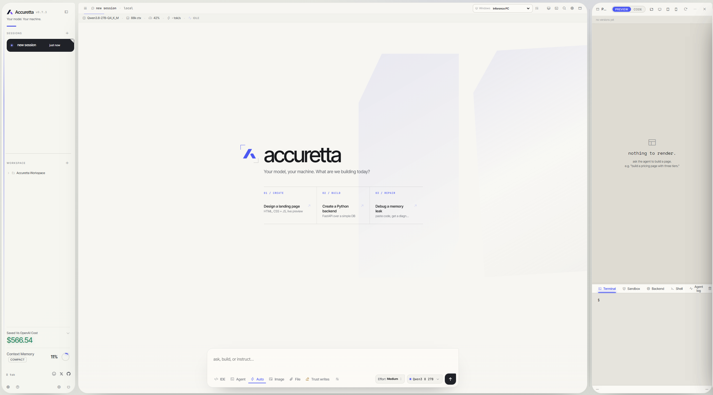
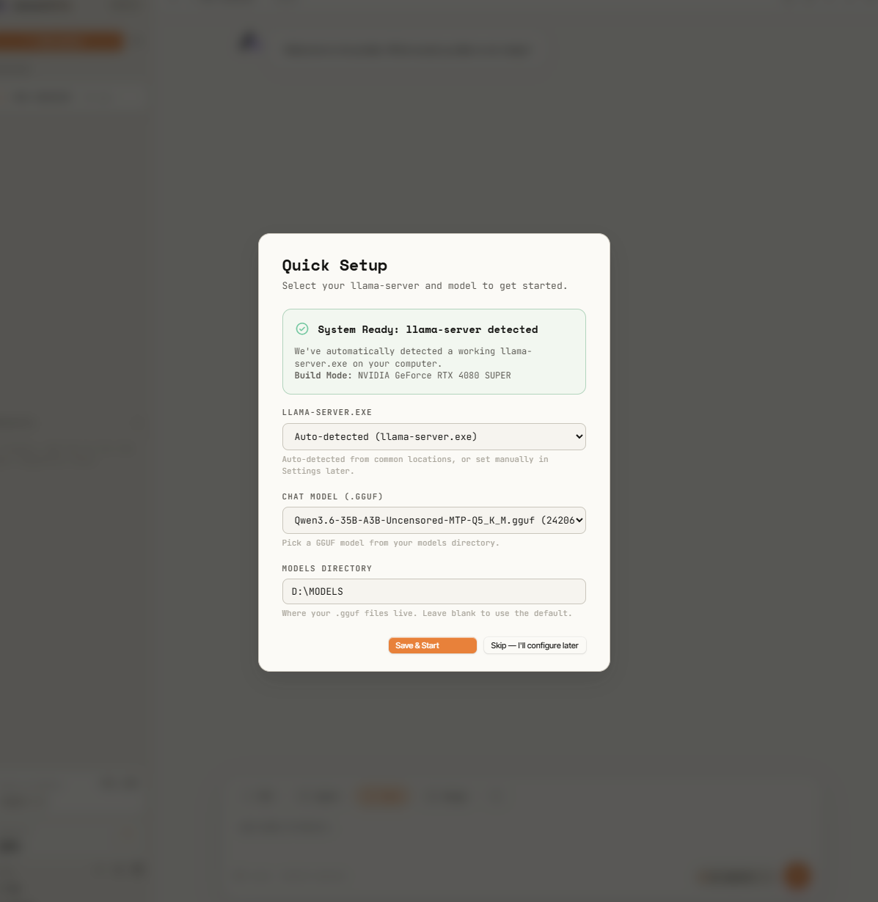

<div align="center">

<picture>
  <source srcset="assets/brand/logo-mark-dark.png" media="(prefers-color-scheme: dark)">
  <source srcset="assets/brand/logo-mark-light.png" media="(prefers-color-scheme: light)">
  
</picture>

# Accuretta

**Run a GGUF model. Give it files, terminals, previews, and guardrails.**

[](LICENSE)
[](https://www.python.org/downloads/)
[](https://github.com/ggml-org/llama.cpp)
[](#privacy)

</div>

<p align="center">
  
</p>

Accuretta is a desktop workspace for local models running through [llama.cpp](https://github.com/ggml-org/llama.cpp). It puts chat history, file tools, persistent shells, live HTML previews, approvals, remote computers, and security tools in one interface.

The model weights, prompts, history, settings, and workspace live on the computer running the bridge. There is no hosted model account, frontend build step, npm dependency tree, or Electron shell. The core is static HTML, CSS, JavaScript, and one Python bridge you can inspect yourself.

## What is included

| Area | What Accuretta does |
| --- | --- |
| Local model runtime | Finds GGUF files, launches llama-server, switches models, watches for crashes, and restores the last working configuration. |
| Hardware-aware tuning | Reads GGUF metadata and chooses context size, GPU offload, KV cache types, batching, and supported speculative decoding options. |
| Agent workspace | Reads and edits files, maps projects, finds symbols and references, checks syntax, runs tests, and works with Git. |
| Live building | Renders HTML beside the chat, saves preview versions, exposes the source, and keeps the terminal and agent log visible. |
| Long tasks | Compacts old conversation history, preserves structured task state, tracks unfinished verification, and can recover an interrupted turn. |
| Remote work | Serves the UI over Tailscale HTTPS and can run commands or transfer files to an allowlisted Mac over SSH. |
| Security work | Provides an authorization-gated recon, validation, exploitation, evidence, and reporting flow for targets you are allowed to test. |
| Local analysis | Inspects Windows events, network connections, PCAPs, APKs, native binaries, firmware, archives, and YARA matches. |
| Extensions | Loads MCP servers from a standard JSON config and supports a Discord owner bridge with reaction approvals. |

None of those rows means “the model can do anything.” Tool availability depends on the operating system, installed optional packages, the selected model, and the permissions you grant. Accuretta reports missing capabilities instead of handing the model a tool that is guaranteed to fail.

## Why it exists

I got tired of renting AI. Cloud subscriptions changed limits, swapped models, and kept the useful controls behind somebody else's account. I already owned the GPU, so I wanted software that treated it like mine.

Accuretta started as the wiring between a GGUF file and llama.cpp. It grew because a chat box alone is not much of a workstation. A useful local model needs access to files, a way to prove its edits work, enough context to finish a long task, and a clear approval point before it touches the machine.

Local models still have limits. A small quantized model will not match the best hosted model at every job. Accuretta gives you control over the trade: pick the model, inspect the tools, set the permissions, and keep the work on hardware you own.

## Setup

You need Python 3.10 or newer and one GGUF model. Accuretta can download a matching llama.cpp build during first-run setup.

### 1. Install Python

Download Python from [python.org](https://www.python.org/downloads/). On Windows, enable **Add Python to PATH** in the installer.

```
python --version
```

### 2. Get Accuretta

Download or clone this repository into a folder, for example `C:\accuretta`.

### 3. Install the optional packages

```
pip install -r requirements.txt
```

The core bridge uses Python's standard library. The packages in `requirements.txt` add image handling, desktop input, document parsing, code parsers, security analysis, and the Discord bridge. Missing packages remove the affected tools from the model's tool list.

### 4. Add a model

Download one GGUF model from Hugging Face. A `Q4_K_M` quant of a 7B to 35B model is a practical first choice. Put it anywhere on disk, such as `D:\MODELS\`.

### 5. Start Accuretta

- **Windows:** double-click `start.bat`. It prepares the desktop-window dependency, clears a stale Accuretta port, and opens the app without a leftover console.
- **Browser mode on any OS:** run `python bridge.py`, then open the printed address. The default is `http://localhost:8787`.

### 6. Finish the setup wizard

<p align="center">
  
</p>

The wizard detects the GPU, finds models, offers an appropriate llama.cpp build, and tunes the selected model before starting it. Sessions, settings, workspace pointers, memories, model profiles, and preview versions are stored under `data/`.

## Files, code, and live previews

The model can work inside a selected workspace instead of pasting every result into chat. Its coding tools cover file reads and edits, project maps, symbol lookup, reference search, syntax checks, test runs, and Git operations.

IDE mode expects one HTML document and renders it in the right pane while the model writes. Each result becomes a saved preview version, so an earlier page is one click away.

<p align="center">
  
</p>

Accuretta also records verification debt. A file edit adds the path to the task's structured state. A successful syntax check or project test clears it. Context compaction and restarts preserve that record, so an untested edit cannot quietly become “finished” because the model lost the earlier messages.

## Approvals and audit records

Reads can run without stopping the conversation. In Soft mode, normal workspace writes, non-destructive Windows or WSL commands, project tests, persistent host-session input, and routine MCP actions can also continue automatically. Medium mode only trusts normal workspace writes. Hard mode asks for every action. Deletions, mutating Git actions, program launches, desktop input, protected or remote changes, and execution following recent web content keep stricter gates regardless of the convenience mode.

Approved actions write a bounded record to `data/action_audit.jsonl`. It stores the tool, target, time, outcome, authorization identity, and hashes of the arguments and result. It does not copy prompts, commands, typed text, or tool output into the audit file.

The approval layer is part of the bridge, not a promise in the system prompt. The model cannot make a direct tool call around it.

## Remote work over Tailscale

Accuretta can expose its interface through Tailscale Serve. The resulting `https://...ts.net` address works from a MacBook or phone without public port forwarding. HTTPS also restores browser clipboard access that is blocked on plain remote HTTP.

To work on a Mac from the model running on a Windows inference PC:

1. Install Tailscale on both computers and sign in to the same tailnet.
2. In Accuretta, open **Settings → Connections → Tailscale remote access** and enable the HTTPS address.
3. Turn on **System Settings → General → Sharing → Remote Login** on the Mac.
4. Select the Mac in Connections, enter its short account name, choose the folders Accuretta may use, and generate the pairing command.
5. Run that command once in Mac Terminal, verify the pairing, then select the Mac from the target picker.

The pairing key is restricted to the Accuretta PC's Tailscale address. Remote reads stay inside the configured folders. Commands, writes, and transfers still require approval. Resolved-path checks stop a symlink from escaping the allowlist.

Remote writes go straight to the Mac. Large files use a staged transfer with hashes and commit checks, which avoids forcing a long HTML or source file through one oversized tool argument. A failed remote action also stays failed; Accuretta does not silently run it on the Windows PC instead.

## Authorized security testing

Red Team tools are disabled by default. Enabling them makes the tool definitions available, but a chat still needs a fresh target and scope authorization before the bridge permits requests.

An engagement moves through recon, validation, exploitation, and reporting. The bridge enforces the target allowlist on requests and redirects, keeps exploitation tools closed until a finding has evidence, and closes the mission when the report is finished.

The scope questionnaire uses an allowlist. Leave **In scope** blank to allow the target entered above and its subdomains. If you fill it in, list every permitted host, including the main target when required. Anything not on that list is blocked automatically. Use **Out of scope** for concrete exceptions such as `admin.example.com`, `10.0.0.0/24`, or `example.com:8443`. Phrases such as `Anything else` are treated as ordinary words, not as a wildcard, and can be left out.

Bug bounty programs can require a researcher identifier in every request. The optional **User agent** field stores that value with the engagement, keeps it visible to the model through long chats and context compaction, and forces it onto HTTP requests at the bridge. A model-supplied or browser-profile User-Agent cannot override the engagement value.

The suite includes:

- port, TLS, HTTP, DNS, subdomain, RDAP, archive, content, exposure, and takeover checks
- parameter discovery, injection probes, SQL injection checks, CORS tests, fuzzing, raw HTTP, and raw TCP
- JWT decoding and testing, encoders, request replay, controlled credential checks, and evidence capture
- scope-enforced Chromium sessions for JavaScript-heavy validation after a finding is confirmed
- CVE matching, finding records, report generation, and retained evidence hashes
- a standalone front-end secret scanner for HTML, JavaScript bundles, lazy-loaded chunks, and source maps

The front-end scanner returns exact high-confidence matches for reporting, separates public identifiers, and hides weak candidates unless requested. It never submits a discovered credential to its provider or uses it for a liveness check.

Browser-backed validation uses a first-party Playwright worker (`rt_browser`). Every network request a session makes, including redirects, popups, iframes, subresources, and WebSockets, is checked against the engagement allowlist; only `about`, `data`, and `blob` schemes are exempt, and they carry no network traffic. Downloads and arbitrary JavaScript evaluation are unavailable. Install the optional browser once with `python -m playwright install chromium` after installing `requirements.txt`.

If a Playwright MCP server is connected, its tools get the same treatment during an engagement: while a mission is active it is the only MCP server kept visible, and URL-bearing arguments are checked against the mission allowlist with the same gate as `rt_browser` before the call reaches the server. Outside an engagement, MCP tools run under approval alone and carry no allowlist.

Scope enforcement covers requests made through Accuretta. It does not filter traffic outside the bridge, so use these tools only on systems you own or have written permission to assess.

## Host, file, and malware analysis

Windows host tools can group active network connections by process, compare them with a saved baseline, parse event logs, and check common persistence locations.

File analysis covers:

- PCAP and PCAPNG summaries
- APK metadata, signing certificates, permissions, exported components, and embedded secrets
- PE, ELF, and Mach-O headers, imports, sections, entropy, signatures, and packer hints
- Squashfs extraction and multi-architecture disassembly for firmware
- YARA scans with bundled or supplied rules
- optional Ghidra decompilation through `pyghidra`

The optional WSL2 guest runs Linux tools inside a separate Ubuntu distro. Accuretta disables Windows executable interop and verifies that setting before each command. This is convenience isolation, not malware containment: mounted paths under `/mnt` are real Windows files, network traffic still leaves through the PC, and commands run as guest root. Never execute an unknown sample there; use a disposable virtual machine with no host mounts for hostile code.

## Persistent shells, desktop tools, and MCP

One-shot commands are useful until the task needs state. Session tools keep SSH, a Python REPL, a debugger, a database client, or another terminal process alive across model turns. The Shell tab is shared, so you can watch the same process and type into it yourself.

Optional desktop tools use Windows UI Automation to inspect ordinary applications as structured controls and operate them without a vision projector. `uiautomation` powers the CPU-only accessibility path; Pillow and pyautogui are needed only for screenshot and raw mouse/keyboard fallbacks. Actions remain approval-gated and require an interactive host desktop session.

Accuretta includes a dependency-free MCP stdio client. Add servers to `bridge_mcp_config.json`, restart the bridge, and their tools appear alongside the built-in tools. MCP calls require approval by default.

```json
{
  "mcpServers": {
    "github": {
      "command": "npx.cmd",
      "args": ["-y", "@modelcontextprotocol/server-github"],
      "env": {
        "GITHUB_PERSONAL_ACCESS_TOKEN": "ghp_example"
      }
    }
  }
}
```

## Skills

Recurring procedures can be packaged as markdown skills and loaded on demand. Drop a `.md` file into `skills/` in the app folder. Each file starts with YAML frontmatter that names the skill, describes when to use it, and estimates its context cost:

````markdown
---
name: my-procedure
description: What this procedure is for.
budget: 2000
---

# My procedure
(instructions the model follows while the skill is active)
````

Type `#` in the composer to pick one (the built-in picker also lists them). A skill loads into the current chat, one skill per chat, and loading another one replaces it. The model reads the procedure until you unload it with the × button next to the skill pill. Bodies over 16,000 characters refuse to load. `skills/` is per-machine user content, so it is gitignored; the format above is all a new user needs.

You can also ask the agent to “save this as a skill” and paste Markdown or point it at a workspace `.md` file. Accuretta writes the finished file into `skills/`, adds or repairs the frontmatter, and calculates `budget` with the active model's tokenizer. If the model server is unavailable, it uses the same conservative token estimate as the rest of the app. Existing skills are never replaced unless you explicitly ask for that.

## Context, recovery, and model health

Long chats use rolling compaction. Older turns are folded into a structured summary while recent messages and tool results stay live. Manual compaction remains available, and failed automatic compaction stops cleanly instead of repeatedly chewing on the same old messages.

Model Health learns a content-free profile for each exact model configuration. It records counts and timings such as tokens, context pressure, completion rate, tool errors, compactions, and generation speed. It does not store prompt text, replies, commands, files, screenshots, tool output, peer addresses, or account names.

After at least 25 turns across three sessions, the advisor can recommend a setting change when the measurements and hardware tuner support one. **Use recommended settings** applies the exact changes. Accuretta then compares the next ten turns with the old configuration and lets you keep or undo the result.

## llama.cpp tuning

The tuner reads the GGUF header for layer count, attention layout, expert counts, KV dimensions, trained context, and vision metadata. It uses those values to choose:

- context size and batch sizes
- GPU layer and MoE expert offload
- K and V cache quantization
- flash attention when the installed binary supports it
- speculative decoding options supported by both the model and llama.cpp build
- memory reserves for the operating system, graphics desktop, and vision projector

Each GGUF keeps its own saved configuration. A failed launch can fall back to a safer setup without overwriting the last known working values. A watchdog can restart llama-server after an unexpected crash and stops retrying when repeated failures point to a bad configuration.

Speculative-decoding and vision-projector choices are also remembered per model. Projector mode is explicit: `off` guarantees a text-only launch, `automatic` looks for a matching nearby mmproj, and `manual` uses the selected file path. The Settings picker can select a projector without typing its path.

Bigger context costs memory and prompt-processing time. The tuner aims for a configuration that fits the detected hardware; it cannot make an oversized model fast.

## Troubleshooting

- **llama-server closes immediately on NVIDIA:** the matching CUDA runtime DLLs may be missing. Put the `cudart-llama-bin-win-cuda-*.zip` contents beside `llama-server.exe`, and match the build to the CUDA version shown by `nvidia-smi`.
- **A model reports a missing tensor:** the llama.cpp build may be older than the model architecture. Update llama.cpp or use a compatible GGUF.
- **Speculative decoding crashes during load:** set it to `off` or `ngram-mod`. `draft-mtp` requires MTP heads in the model and support in the installed binary.
- **Port 8787 is occupied:** `start.bat` clears a stale Accuretta process. In manual mode, set `ACCURETTA_PORT` to another port.
- **A tool is missing:** run the read-only capability report in Accuretta. It names the package, operating-system feature, setting, or authorization that tool needs.

## Privacy

Model inference, prompts, chat history, settings, and workspace files stay on the bridge computer. Accuretta has no telemetry, analytics account, or cloud-sync service.

Outbound traffic occurs when you ask the agent to search or fetch the web, enable Tailscale Serve, connect a Discord bot, call an MCP server that uses the network, or run a security tool against an authorized target. The interface also loads fonts, icons, syntax highlighting, export helpers, and QR support from Google Fonts, unpkg, and jsDelivr. Those providers receive normal request metadata, not chat or workspace contents.

For a network-silent session, block the bridge and its browser or webview at the firewall after the model is loaded. Local inference, files, and ordinary chat continue to work.

## Limits

- Accuretta is a personal project with rough edges and limited documentation.
- Output quality depends on the local model. A weak model with many tools can make a larger mess faster.
- The permission layer reduces accidental damage. It cannot judge whether an approved command is a good idea.
- Accuretta is a front end and tool harness for llama.cpp. It does not replace llama.cpp.
- The live preview is useful for HTML work, but Accuretta is not a full source-code editor.
- Several analysis and desktop features need optional packages or external programs.

## Repository layout

```text
accuretta/
  bridge.py              model launcher, tool runtime, approvals, and HTTP server
  accuretta_app.py       desktop launcher using pywebview
  start.bat              Windows launcher
  index.html             interface shell
  app.js                 interface logic
  app.css                layout and component styles
  colors_and_type.css    theme tokens
  requirements.txt       optional Python packages
  assets/
    audio/               notification sounds
    brand/               light and dark logo marks
    docs/                README screenshots and demos
    icons/               desktop, browser, and install icons
    reactions/           optional response stickers
    social/              repository social-preview artwork and source
  data/                  runtime state, created on first run
```

## Status

Personal project. I work on it when I feel like it. Pull requests are welcome, but I'm not building a roadmap or chasing stars. If you fork it and make it your own, that's the point.

## License

Free for personal use. Run it, poke at it, build on it for yourself. It's not for commercial use though: if you want it in or for a business, or shipped as part of something you sell, ask me first. And please don't pretend you wrote the parts you didn't.

Formally, it's under the [PolyForm Noncommercial License 1.0.0](LICENSE), a real drafted license that permits any noncommercial use and blocks commercial use.
